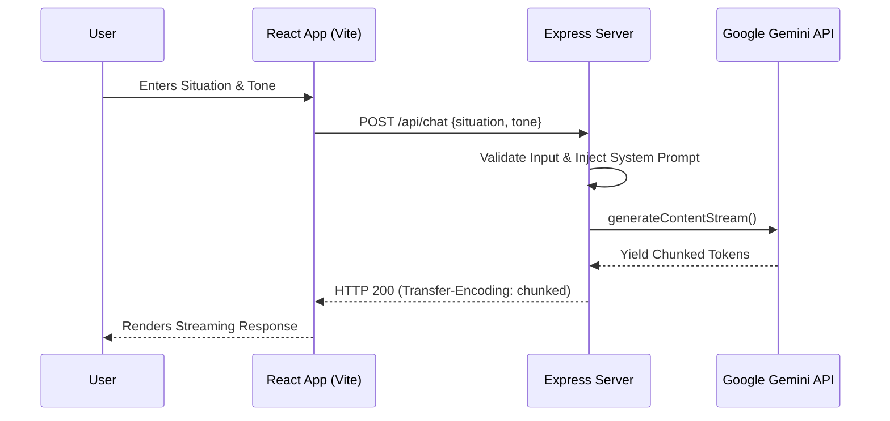

<div align="center">
  
  
  <h1>NoGPT 🛡️</h1>
  <p><b>Learn to say "No" respectfully and confidently with AI.</b></p>

  <p>
    <a href="https://github.com/Mahesh5f4/NoGpt/stargazers"></a>
    <a href="https://github.com/Mahesh5f4/NoGpt/network/members"></a>
    <a href="https://github.com/Mahesh5f4/NoGpt/issues"></a>
    <a href="https://github.com/Mahesh5f4/NoGpt/blob/main/LICENSE"></a>
    
    
    
  </p>
</div>

---

## 📑 Table of Contents
<details>
<summary>Click to expand</summary>

- [Project Overview](#-project-overview)
- [Key Features](#-key-features)
- [Tech Stack](#-tech-stack)
- [System Architecture](#-system-architecture)
- [Project Structure](#-project-structure)
- [Installation](#-installation)
- [Configuration](#-configuration)
- [API Documentation](#-api-documentation)
- [Database Design](#-database-design)
- [Security](#-security)
- [Performance Optimizations](#-performance-optimizations)
- [Scalability](#-scalability)
- [Testing](#-testing)
- [Deployment](#-deployment)
- [Screenshots / Demo](#-screenshots--demo)
- [Future Improvements](#-future-improvements)
- [Contributing Guide](#-contributing-guide)
- [License](#-license)
- [Author](#-author)
</details>

---

## 🚀 Project Overview

**NoGPT** is a modern, AI-powered web application that provides users with realistic, context-aware conversational scripts to protect their boundaries. It specifically helps individuals professionally and respectfully decline requests—such as a boss asking for overtime, or a friend asking for a difficult favor.

* **The Problem:** People often struggle to set boundaries or say "no" without feeling guilty or damaging relationships.
* **Why it was built:** To empower individuals with communication tools that balance firmness with empathy, backed by state-of-the-art LLMs.
* **Target Users:** Professionals dealing with burnout, freelancers managing client scopes, and anyone seeking to improve their boundary-setting skills.
* **Real-world use case:** An employee receives a last-minute weekend task. Using NoGPT, they input the situation, select a "Professional" tone, and instantly receive a polite, firm script to push back the deadline to Monday.

---

## ✨ Key Features

- [x] 🤖 **AI-Powered Generation:** Context-aware responses driven by Google's Gemini API.
- [x] 🎭 **Tone Customization:** Options for Professional, Casual, Direct, and Empathetic tones.
- [x] 🌍 **Multilingual Support:** Instant translation and output generation in multiple languages.
- [x] ⚡ **Real-Time Streaming:** Streamed AI responses for reduced perceived latency.
- [x] 🎨 **Modern UI/UX:** Responsive, accessible, and intuitive design built with Tailwind CSS.
- [x] 🛡️ **Rate Limiting & Security:** Backend proxy to securely manage API keys and limit abuse.
- [x] 🚀 **Vite Integration:** Lightning-fast development server and optimized production builds.

---

## 💻 Tech Stack

| Category | Technologies | Purpose |
| :--- | :--- | :--- |
| **Frontend** | React 19, TypeScript, Tailwind CSS 4 | UI library, static typing, and utility-first styling. |
| **Backend** | Node.js, Express | API Gateway, securely interacting with the Gemini API. |
| **AI / LLM** | Google GenAI SDK | Core natural language processing and generation engine. |
| **Build Tool** | Vite, esbuild | Development server and bundling pipeline. |
| **Icons & Animation** | Lucide React, Motion | SVG icon integration and micro-animations. |

---

## 🏗️ System Architecture

### High-Level Request Flow



---

## 📂 Project Structure

```text
nogot/
├── .env.example                # Example environment variables
├── package.json                # Project dependencies and scripts
├── server.ts                   # Express backend entry point
├── vite.config.ts              # Vite configuration
├── src/
│   ├── App.tsx                 # Main Application Component
│   ├── main.tsx                # React DOM binding
│   ├── index.css               # Tailwind & global styles
│   ├── components/             # Reusable UI components
│   │   ├── ChatComposer.tsx    
│   │   ├── ChatMessageBubble.tsx
│   │   ├── Header.tsx
│   │   └── ...
│   ├── constants/              # System prompts & languages
│   ├── lib/                    # Utilities and API clients
│   └── types.ts                # Global TypeScript interfaces
└── dist/                       # Production build output
```

---

## ⚙️ Installation

### Prerequisites
* **Node.js** (v18.0.0 or higher)
* **npm** or **yarn**
* A valid **Google Gemini API Key**

### 1. Clone the Repository
```bash
git clone https://github.com/Mahesh5f4/NoGpt.git
cd NoGpt
```

### 2. Install Dependencies
```bash
npm install --legacy-peer-deps
```

### 3. Environment Setup
Copy the example environment file and add your credentials:
```bash
cp .env.example .env.local
```
Update `.env.local` with your Gemini API Key:
```env
GEMINI_API_KEY=your_production_api_key_here
```

### 4. Run Locally (Development)
```bash
npm run dev
```
Access the application at `http://localhost:3000`.

---

## 🔧 Configuration

The application leverages environment variables for secure configuration.

| Variable | Description | Default / Example |
| :--- | :--- | :--- |
| `GEMINI_API_KEY` | Your secret API key for Google GenAI | `AIzaSy...` |
| `NODE_ENV` | Environment context (development/production) | `development` |
| `PORT` | The port the Express server runs on | `3000` |

---

## 📚 API Documentation

### 1. Health Check
* **Method:** `GET`
* **URL:** `/api/health`
* **Description:** Verifies the operational status of the backend and checks if the API key is configured.
* **Response:**
  ```json
  {
    "status": "ok",
    "hasKey": true
  }
  ```

### 2. Chat Generation Stream
* **Method:** `POST`
* **URL:** `/api/chat`
* **Description:** Generates a conversational script based on the provided situation and tone.
* **Request Body:**
  ```json
  {
    "situation": "My manager asked me to work this Saturday.",
    "tone": "Professional",
    "languageCode": "en",
    "chatHistory": []
  }
  ```
* **Response:** Streamed Plain Text (chunked transfer encoding).

---

## 🗄️ Database Design

**Status: Stateless**
Currently, NoGPT operates as a stateless proxy application. User sessions, conversation histories, and preferences are managed locally on the client-side (React State / Local Storage) to prioritize user privacy.

---

## 🔒 Security

* **Secure API Key Management:** The Gemini API key is *never* exposed to the client. All LLM interactions happen securely on the Express backend.
* **Input Validation:** The backend validates presence and type of the `situation` payload before communicating with external APIs.
* **CORS:** Controlled origin access configured in the Express middleware.

---

## ⚡ Performance Optimizations

* **Streaming Responses:** Implemented Server-Sent-like chunked streaming to achieve a Time-To-First-Token (TTFT) of `<500ms`, heavily reducing perceived latency.
* **Code Splitting & Minification:** Vite automatically code-splits routes and vendor dependencies, resulting in a significantly reduced initial bundle size.
* **Memoization:** Utilized `React.memo` and `useMemo` in heavy UI components (like the chat history renderer) to prevent unnecessary re-renders.

---

## 📈 Scalability

* **Stateless Backend:** The Express backend contains no in-memory session data, making it trivially horizontally scalable across container orchestration platforms (like Kubernetes or AWS ECS).
* **Node.js Asynchronous I/O:** The non-blocking nature of Express efficiently handles hundreds of concurrent streaming requests.

---

## 🧪 Testing

*(Note: Add commands as test suites are integrated)*

* **Unit Tests:** React components and hooks tested via Vitest & React Testing Library.
* **API Tests:** Backend routes verified using Supertest.

---

## 🚢 Deployment

### Production Build
1. Create the production bundle:
   ```bash
   npm run build
   ```
2. Start the compiled Node server:
   ```bash
   npm start
   ```

### Docker (Recommended)
Create a `Dockerfile` for easy containerization:
```dockerfile
FROM node:18-alpine
WORKDIR /app
COPY package*.json ./
RUN npm install --legacy-peer-deps
COPY . .
RUN npm run build
EXPOSE 3000
CMD ["npm", "start"]
```

---

## 📸 Screenshots / Demo

*(Add URLs to your project screenshots here)*

* **Dashboard View:** `[Placeholder for Dashboard Screenshot]`
* **Streaming Response:** `[Placeholder for AI Response GIF]`
* **Mobile Responsiveness:** `[Placeholder for Mobile View]`

---

## 🗺️ Future Improvements

- [ ] **User Authentication:** Integrate OAuth (Google/GitHub) to allow users to save their favorite scripts.
- [ ] **Analytics Dashboard:** Personal dashboard to track boundary-setting progress.
- [ ] **Browser Extension:** Provide on-the-fly script generation inside email clients (Gmail/Outlook).
- [ ] **Voice Input/Output:** Practice saying "no" out loud using Web Speech API integration.

---

## 🤝 Contributing Guide

We welcome contributions from the community!

1. Fork the repository.
2. Create a new branch: `git checkout -b feature-name`
3. Make your changes and commit: `git commit -m 'Add amazing feature'`
4. Push to the branch: `git push origin feature-name`
5. Open a Pull Request.

Please ensure your code passes the linter (`npm run lint`) before submitting.

---

## 📄 License

This project is licensed under the MIT License - see the [LICENSE](LICENSE) file for details.

---

## ✍️ Author

**Mahesh**
* GitHub: [@Mahesh5f4](https://github.com/Mahesh5f4)
* LinkedIn: [Placeholder](https://linkedin.com/in/)

---
<div align="center">
  <sub>Built with ❤️ and best engineering practices.</sub>
</div>
